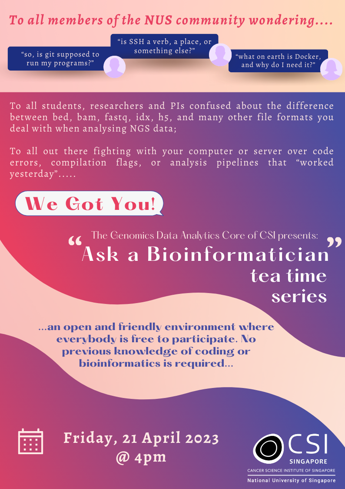
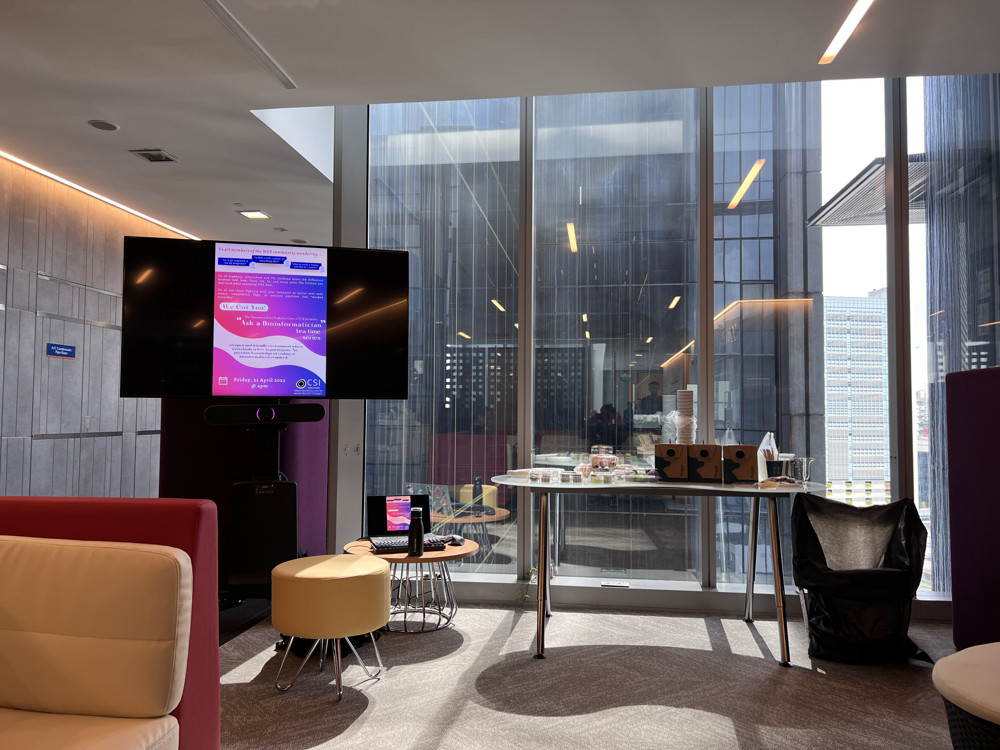

# 'Ask a Bioinformatician' - Tea Time Event - April 2023

- **Date:** 21 April 2023  
- **Event:** First "Ask a Bioinformatician" Tea Time  
- **Host:** Genomics Data Analytics Core (GeDaC)  
- **Venue:** Cancer Science Institute of Singapore  

This event provided an open and friendly environment for **students**, **researchers**, and **principal investigators** to ask questions about **bioinformatics**, **coding**, and **data analysis**.

Participants brought a wide range of questions, from basic concepts such as the differences between file formats (e.g., BED, BAM, FASTQ, HDF5) to troubleshooting code errors and understanding tools like Git, SSH, and Docker. The GeDaC team provided hands-on support and practical advice, helping attendees resolve issues and gain confidence in their computational work.

GeDaC also took the opportunity to introduce the CloudFlow Portal, showcasing how this platform can streamline bioinformatics analyses and data management. Attendees learned how CloudFlow can simplify complex workflows, making advanced computational tools more accessible to the research community.

The informal tea time setting encouraged discussion and knowledge sharing, with no prior experience in coding or bioinformatics required. Feedback from attendees was overwhelmingly positive, with many expressing appreciation for the approachable format and the opportunity to learn from experienced bioinformaticians.

We look forward to organizing more sessions in the future to continue supporting the NUS research community!
