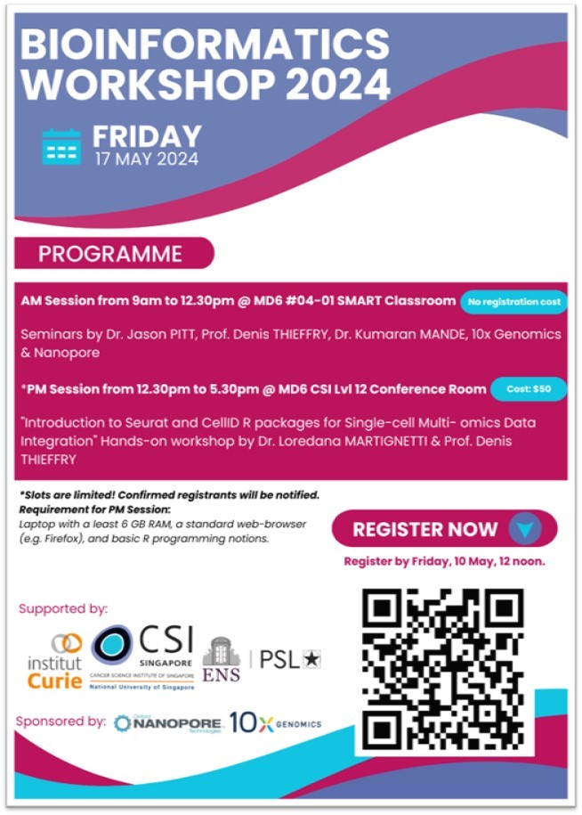

# Bioinformatics Workshop Overview

The Bioinformatics Workshop was co-organised by CSI Singapore, Institut Curie, and ENS.

Gedac assisted in setting up an RStudio Server on AWS to support all hands-on workshop activities.

## User Accounts and Access

User accounts were generated for all workshop participants. Access options included:

- RStudio Server Web Access  
- SSH Access to the Server

## Server Access and Setup

After testing the workshop scripts on Professor Denis's account, the R directory (containing R configurations, packages, and scripts) and the workshop directory were copied to all other user accounts.

## Workshop Setup Resources

- [RStudio Setup Guide on AWS](https://gitlab.com/csi_gedac/cloud-apps)