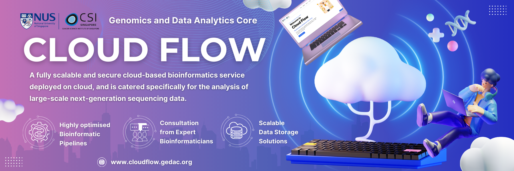

# GeDaC Newsletter - February 2025

## Dear CSI Researchers,

We are happy to announce a monthly newsletter dedicated to keeping you informed about the latest updates in bioinformatics and computational biology research at CSI.  

Our goal is to provide faculty, students and staff with updates on recent research, new tools, career opportunities, and information about events, conferences, workshops and internships - that can benefit staff and students involved in genomics research.  

We also plan to highlight and provide updates on resources available to researchers via the **Genomics and Data Analytics Core (GeDaC)** at CSI.

<!--truncate-->

---

### Featured Resource: CloudFlow 🚀

[CloudFlow](https://www.cloudflow.gedac.org/) 🚀, is a web-based platform designed specifically for computational biology research at CSI. It provides:

* Easy access to best-practice bioinformatics pipelines running in the cloud
* Current focus on RNA-related pipelines
* Opportunities for expansion based on researcher needs

For more information about the platform, please visit our [documentation](https://docs.cloudflow.gedac.org/).

---

### What to Expect Each Month

* 📊 Summaries of recent bioinformatics research
* 🧬 Announcements of new tools, software and data releases
* 🗓️ Upcoming conferences, workshops and internships
* 📈 Resource updates from the GeDaC team

We are thrilled to equip you and your teams with the latest information and resources to stay ahead in this rapidly evolving field and propel your research forward.

### Connect With Us

If you have any news, research, or announcements for the newsletter, or if you have questions, feedback, or need support, we'd love to hear from you! 

Feel free to reach out at [support@gedac.org](mailto:support@gedac.org), and we'll get back to you as soon as possible.

---

**Best regards,**  

📧 [csi_gedac@nus.edu.sg](mailto:csi_gedac@nus.edu.sg) 
🌐 [Website](https://www.gedac.org/) | 🔗 [GitHub](https://github.com/CSI-Genomics-and-Data-Analytics-Core) | 🛠️ [Helpdesk](https://support.gedac.org/support/tickets/new)