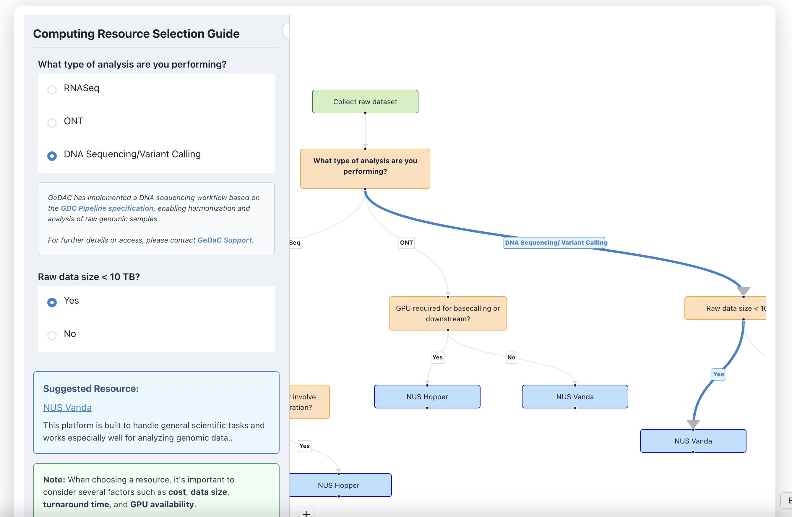

# GeDaC Newsletter - May 2025

## Dear CSI Researchers,

We are excited to bring you the May edition of our monthly newsletter dedicated to keeping the CSI research community updated on the latest in bioinformatics and computational biology.

---
### CSI/NUS Resource Helper 🤝

We have developed a web tool to help CSI staff and students easily discover available computational and storage resources.

CSI staff and students often lack awareness of the computational and storage resources available to them, leading to under-utilization of existing infrastructure and inefficiencies in research workflows.

You can access the tool at [https://www.gedac.org/helper](https://www.gedac.org/helper).

<!--truncate-->

> **Note:** When choosing a resource, it's important to consider several factors such as **cost**, **data size**, **turnaround time**, and **GPU availability**.  
>  
> If you'd like help planning or selecting the right resources for your project, please [contact the GeDaC team](/contact).

### GeDaC Resource updates

#### **CloudFlow Platform**
The [CloudFlow](https://www.cloudflow.gedac.org/) platform offers CSI researchers streamlined access to best-practice bioinformatics pipelines in the cloud. Our team is ready to support you with computational requirements and pipeline setup.

---

**Best regards,**  
GeDaC Team, CSI - NUS  
📧 [csi_gedac@nus.edu.sg](mailto:csi_gedac@nus.edu.sg) 
🌐 [Website](https://www.gedac.org/) | 🔗 [GitHub](https://github.com/CSI-Genomics-and-Data-Analytics-Core) | 🛠️ [Helpdesk](https://support.gedac.org/support/tickets/new)