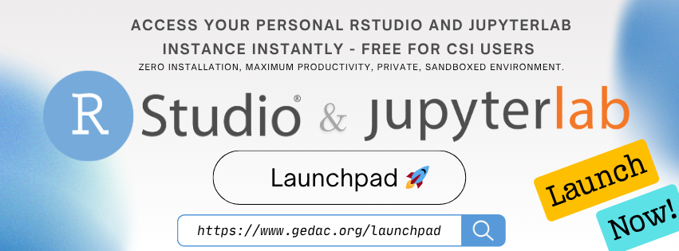

# GeDaC Newsletter - July 2025

## Dear CSI Researchers,

We are excited to bring you the July monthly newsletter dedicated to keeping the CSI research community updated on the latest in bioinformatics and computational biology.

---

## 🚀 GeDaC Launchpad

We are happy to release **[GeDaC Launchpad](https://www.gedac.org/launchpad)**, a new web-based platform that provides CSI researchers with free and instant access to customizable RStudio and JupyterLab environments via their browser. Simply log in with your institutional email to launch a private, pre-configured workspace.

<!--truncate-->

**[GeDaC Launchpad](https://www.gedac.org/launchpad)** is perfect for data analysis, learning programming, collaboration, and workshops. Environments come pre-configured with many popular Bioconductor packages - DESeq2, Seurat, LIMMA - that can be used to analyze bulk, single-cell, and spatial RNA-seq datasets.

---

## 🌐 Stay Connected

Checkout our [GeDaC website](https://www.gedac.org/) to find the information and tools you need for your research.

If you have any news, research, or announcements for the newsletter, or if you have questions, feedback, or need support, we'd love to hear from you!

Feel free to reach out at csi_gedac@nus.edu.sg, and we'll get back to you as soon as possible.

---

**Best regards,** 

📧 [csi_gedac@nus.edu.sg](mailto:csi_gedac@nus.edu.sg) 
🌐 [Website](https://www.gedac.org/) | 🔗 [GitHub](https://github.com/CSI-Genomics-and-Data-Analytics-Core) | 🛠️ [Helpdesk](https://support.gedac.org/support/tickets/new)