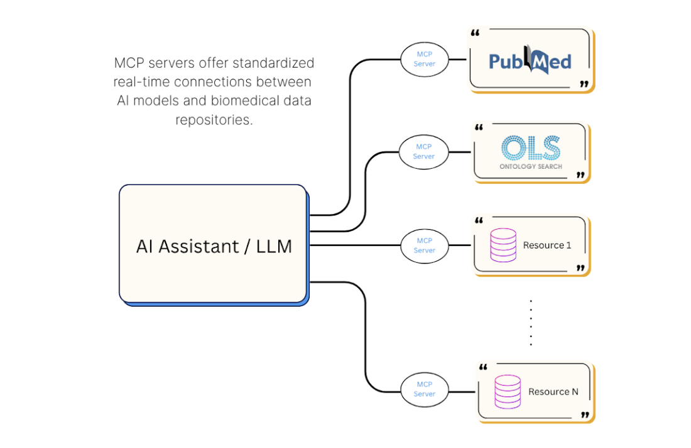

# GeDaC Newsletter - October 2025

## Dear CSI Researchers,

We are excited to bring you the October monthly newsletter dedicated to keeping the CSI research community updated on the latest in bioinformatics and computational biology.

---

## 🧰 New Tools and Software Updates

### MCP Servers and AI in Biomedical Data Access

Large language models (LLMs) are changing how scientists work with data, helping summarize papers, analyze results, and brainstorm new ideas. However, most AI systems still operate in isolation from the vast scientific databases that store real-world genomic and clinical data. The **Model Context Protocol (MCP)** is a new open standard designed to bridge that gap. It acts like a universal connector, allowing AI models to securely access external data sources and computational tools in a consistent, structured way.

<!--truncate-->

In the biomedical field, the **Model Context Protocol (MCP)** can help AI systems connect directly to key scientific resources such as genomics, proteomics, literature, and clinical databases. MCP servers make these data sources available in a structured format that AI can understand and use effectively. For example, an AI tool could ask, *"Show me variants in gene X found in tissue Y with related clinical details,"* and the MCP server would return relevant results from multiple databases. This approach can help researchers explore data more easily, generate new hypotheses, and accelerate scientific discovery.

On the platform side, **Claude** now offers *first-class support* for MCP servers. Through MCP connectors and desktop extensions, Claude can directly link to external tools and data platforms, enabling natural-language querying and results with source citations. This capability brings researchers closer to interactive, context-aware AI assistants that can navigate [real biomedical data ecosystems](https://support.claude.com/en/articles/12614768-getting-started-with-claude-for-life-sciences).

At **NUS**, staff and students can access advanced large language models through [AI-know Chat](https://ai-know.nus.edu.sg/ai-chat) for research and academic use. The platform allows users to explore ideas, analyze text, and engage with cutting-edge AI models in a secure campus environment. While MCP integrations are not yet available, these capabilities represent an important step toward broader AI-assisted research applications in the future.

**Useful links for reference:**

- 🔗 [MCP Specification & Overview](https://www.anthropic.com/news/model-context-protocol)
- 🔗 [BioMCP Concepts](https://biomcp.org/concepts/01-what-is-biomcp/)
- 🔗 [EBI Ontology Lookup Service MCP](https://www.ebi.ac.uk/ols4/mcp)
- 🔗 [Claude for Life Sciences](https://www.anthropic.com/news/claude-for-life-sciences)

---

## 🌐 Stay Connected

Check out our [GeDaC website](https://www.gedac.org/) to find the information and tools you need for your research.

If you have any news, research, or announcements for the newsletter, or if you have questions, feedback, or need support, we'd love to hear from you!

Feel free to reach out at [csi_gedac@nus.edu.sg](mailto:csi_gedac@nus.edu.sg), and we'll get back to you as soon as possible.

---

**Best regards,**  
  
📧 [csi_gedac@nus.edu.sg](mailto:csi_gedac@nus.edu.sg) 
🌐 [Website](https://www.gedac.org/) | 🔗 [GitHub](https://github.com/CSI-Genomics-and-Data-Analytics-Core) | 🛠️ [Helpdesk](https://support.gedac.org/support/tickets/new)
