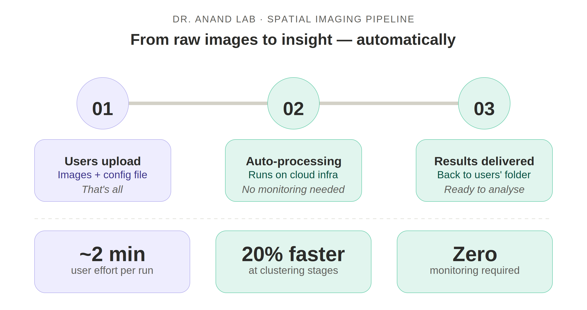
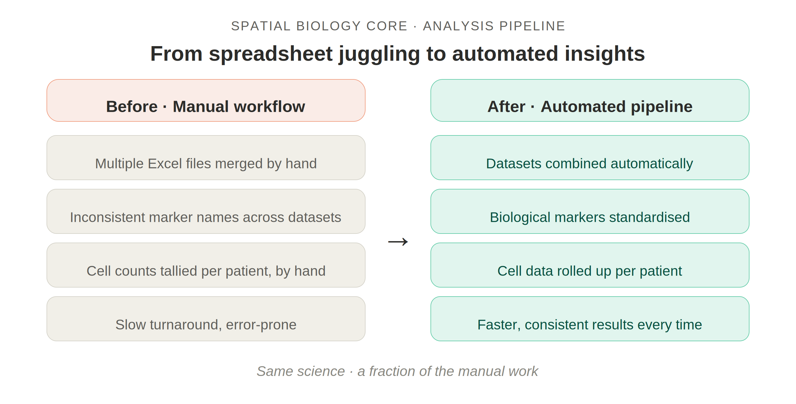

# GeDaC Newsletter - April 2026

## Dear CSI Researchers,

This month, we are excited to highlight how GeDaC is accelerating discovery through **automated data pipelines**. We are helping labs transition from raw data to actionable insights faster and more reliably by significantly reducing manual intervention.

---

## ⚙️ Featured Works: From Data to Insights

### Spatial Imaging Pipeline Automation

Processing spatial imaging datasets used to mean babysitting long compute jobs and stitching outputs together manually. Not anymore. We have developed a robust, end-to-end pipeline designed to process spatial imaging datasets in a fully reproducible manner.

<!--truncate-->

The new pipeline asks one thing of researchers: upload the **images** and **a short config file**. From there, the system takes over — processing runs automatically on dedicated research infrastructure, and results land back in the project folder when it's done.

The payoff? A 20% speed improvement at the most demanding processing stages, lower compute costs, and researchers who can actually spend their time doing science.

### Spatial Biology Core (SBC): Automated Analysis Pipeline

We have successfully modernized a traditionally manual, Excel-based workflow into a structured, high-throughput pipeline. Datasets are combined, biological markers are standardised, and cell-level data is rolled up into patient summaries — consistently, every time. What used to take hours of careful work now happens in the background while the team focuses on what the data actually means.

---

## 🛠️ Engineering Highlights

To support these scalable analyses, we have integrated several advanced engineering standards into our workflows:

- **Containerized Execution**: Using Docker to ensure pipelines run identically across all environments.
- **Hybrid Cloud Workflows**: Seamless integration between AWS and on-premise compute resources.
- **Manifest-Driven Runs**: Utilizing structured manifests to trigger automated data synchronization and result delivery.

---

## What This Means for You

These advancements are designed to eliminate repetitive manual work and improve the reproducibility of your findings. By leveraging these automated tools, your lab can accelerate the journey from data collection to scientific insight.

---

## 🌐 Stay Connected

Check out our [GeDaC website](https://www.gedac.org/) to find the information and tools you need for your research.

If you have any news, research, or announcements for the newsletter, or if you have questions, feedback, or need support, we'd love to hear from you!

Feel free to reach out at [csi_gedac@nus.edu.sg](mailto:csi_gedac@nus.edu.sg), and we'll get back to you as soon as possible.

---

**Best regards,**  
  
📧 [csi_gedac@nus.edu.sg](mailto:csi_gedac@nus.edu.sg) 
🌐 [Website](https://www.gedac.org/) | 🔗 [GitHub](https://github.com/CSI-Genomics-and-Data-Analytics-Core)
