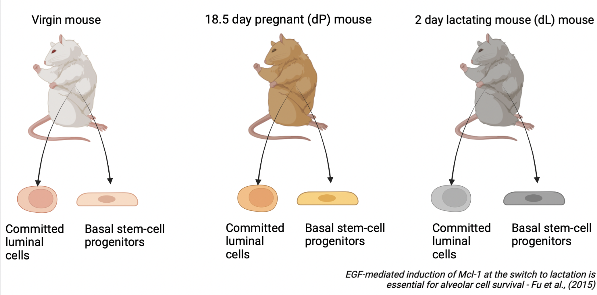

# Objective

In the first post of this series, we guide the user through the results of the GeDaC RNA-seq pipeline. 
# Background  

To illustrate the results of the GeDaC RNA-seq analysis pipeline, we reanalysed
a single-end RNA-seq dataset of the mouse mammary gland from [Fu et al., 2015](https://www.nature.com/articles/ncb3117). As summarised in Figure 1, the dataset consists of mouse mammary gland samples derived from 3 developmental stages: 
virgin mice, day 18.5 pregnant mice (dP) and day 2 lactating mice (dL), with 2 biological replicates 
per developmental stage (rep1 and rep2). For each of the 6 samples, we study the gene expression
across 2 cell populations: basal stem-cell enriched cells and committed luminal cells.
Hence, there are a total of 6 x 2 = 12 single-end fastq files which we uploaded
to the GeDaC portal for RNA-seq analysis.

# Guided results tour

## Directory structure

Upon unzipping the downstream analysis results folder, we observe that the
folder has 5 top-level files and 15 subfolders (color blue, Figure 2A). We first examine
the contents of the files.

 Top-level directory structure B) Contents of subfolders")

## Files

### Multi-dimensional scaling (MDS) plots

The multi-dimensional scaling (MDS) plot (`samplesType_MDS.png`) is a very useful exploratory plot that displays
the differences between samples in an unsupervised manner. In our experiment, we 
are interested to test for differential expression between samples from different
developmental stages (e.g. virgin vs lactating) or cell populations (basal vs luminal). 
Hence, we would like to see that samples cluster based on these conditions. In Figure
3A, we note that the basal and luminal samples are cleanly separated
along the leading fold-change dimension (first dimension), which explains a large (68%) proportion
of the variance in the dataset. Hence, we expect that pairwise comparisons of basal vs luminal cell populations will result in the largest number of DE genes as opposed to comparisons
of different developmental stages within a particular cell population (e.g. basal_virgin vs basal_pregnant). The facet plot in Figure 3B (`samplesType_MDS_facetWrap.svg`) splits the 
MDS plot by sample type, which may aid the visualisation of samples by their status. 

If users specify in the annotation template that samples come from different sequencing lanes or libraries,
then our pipeline will also generate MDS plots (`lane_effects_MDS.svg`) that color samples based on these
factors . An example of a technical source of variation from a different experiment
due to differences in sequencing lanes is shown in Figure 3C. 

*Recommendation*:
The GeDaC RNA-seq pipeline does *not* exhaustively assess all possible sources of batch effects, nor do we
perform batch correction on the user's behalf. In general, and especially if samples do not cluster based on the biological condition of interest or if few DE genes were identified in the experiment, 
users should further check for possible technical or biological sources of batch effects 
in their dataset that may interfere with the condition's signal. 
Possible technical sources of variation include differences in sample preparation (e.g. rRNA depletion vs polyA enrichment), sequencing libraries or 
technicians that handle the data. Possible biological sources of variation include
the ethnicity of patients in a clinical trial or the genetic background of cell line samples.

It is critical that users consult with a statistician / bioinformatician to implement good experimental design
and mitigate possible sources of batch effects before conducting the study. However, if the above analysis reveals considerable batch effects in the data, one can attempt to remove them 
computationally either by passing the factors or covariates into the design matrix
or by implementing specific batch-effect correction tools such as `ComBat-Seq` (Zhang et al., 2015).

 Multi-dimensional scaling (MDS) plot highlighting that samples are separated primarily by cell population (basal or luminal) B) MDS plot split by sample type C) MDS plot showing lane-specific effects along the second dimension (Lanes 002 vs 003). D) Mean-variance plot")

### Mean-variance plot

The mean-variance plot (`mean-var.svg`) is a plot of the log2 residual standard deviations against 
the mean log-CPM values. It is well-known that in RNA-seq count data, the mean and variance of 
the counts are not independent. In particular, the variance across replicates is greater
than the mean for genes with a high mean expression. Our analysis pipeline with `limma` relies on the removal
this mean-variance relationship. Hence, through the mean-variance plot, we check for whether this
mean-variance relationship is removed after applying the voom precision weights. Figure 3D is an ideal mean-variance plot which shows that the variance is no longer dependent on the mean expression level.

### Normalised count matrix

In our pipeline, normalisation is performed using the trimmed mean of M-values (TMM) method
that is implemented via the `edgeR` package. This normalisation method works by calculating fold changes and
absolute expression levels relative to a "good" reference sample, which serves to
handle compositional biases across libraries.  

For convenience, we provide the user with the `TMMnormalised_log2cpm_countMatrix.txt` file. Whilst we recommend using TMM-normalisation as a default, it comes with the key assumption that
the majority of genes in the study are not differentially expressed. In other words, the number of up/down-regulated genes between the conditions of interest are similar. If the user has *a priori*
grounds to believe that global changes in gene expression are expected in their study (for an example of such a study, see [Hu et al., 2014](http://genesdev.cshlp.org/content/28/4/396.long)), then
an alternate normalisation method (e.g. using negative control or housekeeping genes) should be performed. We provide the raw data (`countMatrix/counts_raw.txt`) for users to perform their own normalisation if desired. For more information, we refer to [Evans et al., 2018](https://academic.oup.com/bib/article/19/5/776/3056951).

### Gene annotation table

We also provide the user with a gene annotation table (`geneAnnotationTable.txt`), which
contains the ensembl transcript and gene id, as well as gene biotype, for each gene
in the count matrix. This serves as feature-level metadata and can be useful for users who want to re-process the count matrix (`countMatrix/counts_raw.txt`) on their own.

## Exploring the contents of each folder

We now investigate the contents of the subfolders as shown in Figure 2B.

First, we address why the folders are named in this particular manner. To compare the differences in gene expression levels between two groups, we specify the `contrasts` between the fitted linear models. For example, the `basal_dL-basal_dP` subfolder contains the results (e.g. DE and 
ReactomePA enrichment analysis results) for the `basal_dL - basal_dP` contrast. As there are a total of $6 \choose 2$ = 15 possible comparisons between groups, we have 15 directories corresponding to each of the 15 contrasts. 

### Differentially expressed genes

In the `basal_dL-basal_dP_sorted_DEG.txt` file, we obtain the list of DEGs that 
pass the false discovery rate cutoff of 0.05. In the event that no differentially expressed
gene was identified at this threshold, this file will not be produced. In that case, users may want to 
refer to the `basal_dL-basal_dP_allDEGnoCutoff.txt` file instead which contains all
the DEGs prior to applying the cutoff filter. The `basal_dL-basal_dP_DEG_across_samples.tsv` 
file indicates the normalised expression of these DEGs across all 12 samples. 

Figure 4 displays a subset of the top 3 DEGs, sorted by logFC, identified in the `basal_dL - basal_dP` contrast. In the first row, we observe that the `Igkc` gene has a logFC of -6.13. This means that on average,
this gene is more highly expressed in the `basal_dP` samples compared to the `basal_dL` sample, 
or equivalently, more lowly expressed in the `basal_dL` sample than the `basal_dP` sample.
In particular, `basal_dP` samples express `Igkc` about $2^{6.13} \approx 70$ times higher
than the `basal_dL` samples on average. This gene has an adjusted p-value (q-value) of 0.0004, which
is lower than our predefined cutoff of 0.05. In the second row, we observe that the `Csn1s2b` gene has a logFC of 6.10, which means that on average, it is more highly expressed in the `basal_dL` sample compared to the 
`basal_dP` sample by about $2^{6.10} \approx 68$ times.  We can then validate these findings
by  testing for the expression of these genes in biological samples through
qPCR or in-situ hybridisation experiments. 

As a test to the reader, what would you expect to find when checking the `Igkc` row in the `basal_dL-basal_dP_DEG_across_samples.tsv` file?

### Heatmap and volcano plot

 Heatmap B) Volcano plot")

We also provide a heatmap (`basal_dL-basal_dP_heatmap.svg`) and volcano plot (`basal_dL-basal_dP_volcano.svg`) for visualisation of the results of the differential expression analysis. 

Figure 5A shows a heatmap which displays the expression of the DEGs across the 12 samples, with the magnitude of the
expression levels highlighted by a spectrum of colors. As shown in the color key at the 
top lefthand corner of the plot, blue cells represent lower level of expression whereas 
red cells indicate a higher level of expression. Each row is z-score standardised; that is to say,
each sample's gene expression value is subtracted by the gene expression average across all samples, and
then divided by the gene expression's standard deviation. This helps to enhance clusters of 
genes with similar trends in expression between samples.

Figure 5B displays a volcano plot. A volcano plot is a plot of the adjusted p-value vs the log fold-change. Specifically,
it plots the negative log (in base 10) and the log fold-change (in base 2). Hence, 
the higher the point on the y-axis, the smaller the p-value. Points falling to the right
represent genes that are upregulated in the `basal_dL` vs `basal_dP` samples, whereas those that 
fall to the left are downregulated. Points clustering close to 0 have similar mean
expression levels. The more spread out the points (the lower the "wings"), the greater the difference in gene expression between the treatment groups. The blue and red vertical lines were included at the 
logFC = 0.5 mark as visual aids - points to the left or right of these lines are 
expressed around 1.5 times lower or higher in the `basal_dL` samples relative to the `basal_dP`
samples. The grey horizontal line indicates an adjusted p-value of 0.01.  

### Reactome enrichment analysis

Given the list of DEGs, we perform pathway analysis based on the REACTOME pathway database.
Specifically, we conduct an over-representation analysis (ORA) on the list of upregulated and downregulated DEGs separately. The ORA approach uses the hypergeometric model to assess whether the number of DEGs associated with a reactome pathway is larger than expected. We provide several representations 
of the enrichment analysis results, including a bar plot (Figure 6A),
dot plot (Figure 6B), UpSet plot (Figure 6C), 
Emap plot (Figure 6D) and Cnet plot (Figure 6E). Figure 6
shows the results of the Reactome enrichment analysis for the DEGs identified in the
`basal_dL-basal_dP` contrast.

The horizontal barplot shows the enrichment scores (in the form of p values) and count as bar height and color respectively. The count corresponds to the number of DEGs that fall within the specified gene set. E.g. in Figure 6A, around 100 of the upregulated DEGs in the
`basal_dL-basal_dP` contrast belong to the `Rho GTPase cycle` pathway. 

The dot plot is similar to the barplot, with an additional level of encoding. Here,
we can also display the gene ratio, defined to be the gene count divided by the
set size (total number of genes in the gene-set). 

The UpSet plot is a useful visualisation tool to visualise complex intersections and relationships between
genes and gene sets. For instance, in Figure 6C, we observe that 30 genes are found
to be unique to the `Rho GTPase cycle` gene set, whereas around 15 genes are shared between the 
`Rho GTPase cycle` and `Rac1 GTPase cycle` gene sets.

Other similar ways to visualise the complex associations between genes and gene sets
are the Emap and Cnet plots. In the Emap (enrichment map) plot, each node corresponds to
a gene set and edges connect overlapping gene sets. Whereas the preceding plots highlight
the significantly enriched gene sets, users may be interested to know the genes 
that are involved in these significant terms. The Cnet plot is useful for this
purpose as it clusters the genes together by gene set association,
and colors the edges connecting genes together by the gene set. 

 Bar plot B) Dot plot C) UpSet plot D) Emap Plot E) Cnet plot")

# Conclusion

In this blog post, we have taken the reader through the results of the GeDaC RNA-seq pipeline
using a publicly available single-end RNA-seq dataset. We welcome CSI investigators who wish
to discuss their results in greater detail to contact the GeDaC bioinformaticians by submitting a ticket via our GeDaC portal [helpdesk](https://www.portal.gedac.org/helpdesk/). For more complex data analysis projects,
we recommend visiting our [webpage](https://www.gedac.org) to view the consulting services that we provide that may cater to your needs.
# References

Evans, C., Hardin, J., Stoebel, D. M. (2017). Selecting between-sample RNA-seq normalization methods from the perspective of their assumptions. Briefings in Bioinformatics, 19(5), 776–792. https://doi.org/10.1093/bib/bbx008 

Fu, N.Y., Rios, A., Pal, B., Soetanto, R., Lun, A.T.L., Liu, K., Beck, T., Best, S., Vaillant, F., Bouillet, P., Strasser, A., Preiss, T., Smyth, G.K., Lindeman, G., , and Visvader, J. (2015). EGF-mediated induction of Mcl-1 at the switch to lactation is essential for alveolar cell survival. Nature Cell Biology 17, 365–375. https://doi.org/10.1038/ncb3117

Hu, Z., Chen, K., Xia, Z., Chavez, M., Pal, S., Seol, J.-H., Chen, C.-C., Li, W., Tyler, J. K. (2014). Nucleosome loss leads to global transcriptional up-regulation and genomic instability during yeast aging. Genes &amp; Development, 28(4), 396–408. https://doi.org/10.1101/gad.233221.113 

Marc Gillespie, Bijay Jassal, Ralf Stephan, Marija Milacic, Karen Rothfels, Andrea Senff-Ribeiro, Johannes Griss, Cristoffer Sevilla, Lisa Matthews, Chuqiao Gong, Chuan Deng, Thawfeek Varusai, Eliot Ragueneau, Yusra Haider, Bruce May, Veronica Shamovsky, Joel Weiser, Timothy Brunson, Nasim Sanati, Liam Beckman, Xiang Shao, Antonio Fabregat, Konstantinos Sidiropoulos, Julieth Murillo, Guilherme Viteri, Justin Cook, Solomon Shorser, Gary Bader, Emek Demir, Chris Sander, Robin Haw, Guanming Wu, Lincoln Stein, Henning Hermjakob, Peter D’Eustachio, The reactome pathway knowledgebase 2022, Nucleic Acids Research, 2021;, gkab1028, https://doi.org/10.1093/nar/gkab1028

Zhang, Y., Parmigiani, G., Johnson, W. E. (2020). Combat-seq: Batch effect adjustment for RNA-seq count data. NAR Genomics and Bioinformatics, 2(3). https://doi.org/10.1093/nargab/lqaa078 
