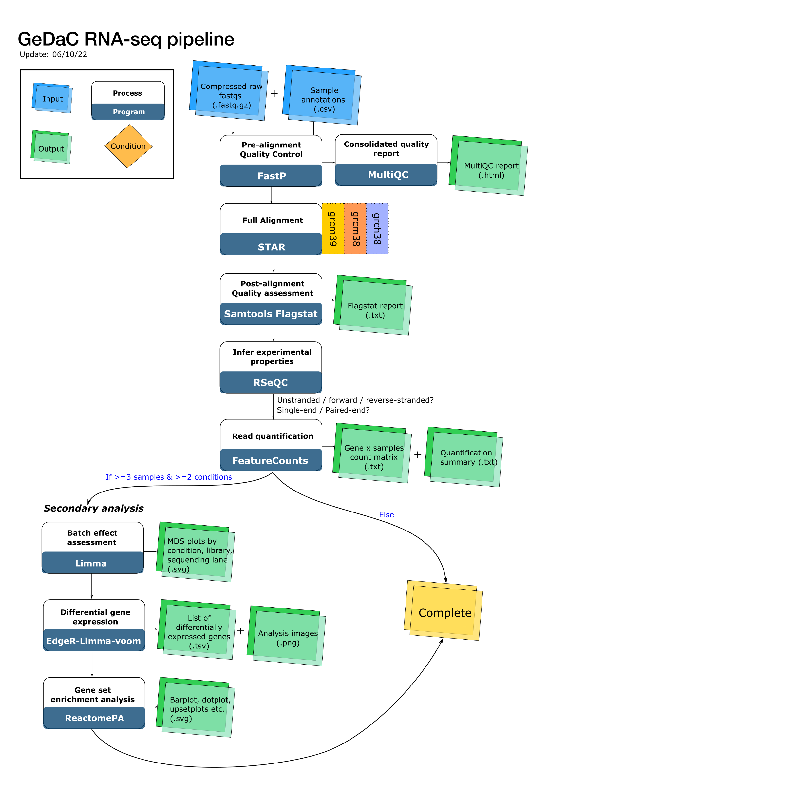

# Objective 

In the second post of our series covering the RNA-seq pipeline, we introduce
the reader to its inner workings with brief descriptions of
the applications used and associated output where appropriate. This post was written for users of all stripes 
who are keen to peek under the hood.

# Language

The GeDaC RNA-seq pipeline, like most other pipelines on our [portal](https://www.portal.gedac.org/), is written in the [Workflow Description Language (WDL)](https://github.com/openwdl/wdl).
Writing our pipelines in a workflow language, as opposed to stringing together a
collection of Bioinformatics scripts, facilitates the reproducibility, maintability, portability and scalability of
our workflows [(Perkel, 2019)](https://www.nature.com/articles/d41586-019-02619-z). Behind
the [scenes](https://www.gedac.org/blog/010822_gedac_portal_beta_release/), the pipeline is executed by the [Cromwell](https://github.com/broadinstitute/cromwell) workflow 
management system developed by the Broad Institute. Cromwell sends the jobs to  
[AWS Batch](https://aws.amazon.com/batch/) to dynamically provision the optimal quantity and type of compute resources.

# Building blocks of the RNA-seq pipeline

The RNA-seq pipeline comprises 5 steps: 

1. Pre-alignment quality control  
2. Alignment
3. Post-alignment quality control
4. Read quantification
5. Downstream analysis of the count matrix. 

## Quality control

Applications used: `fastp` (Chen et al., 2018) & `MultiQC` (Ewels et al., 2016)

Following Bioinformatics best practices ([Conesa et al., (2016)](https://genomebiology.biomedcentral.com/articles/10.1186/s13059-016-0881-8)), our pipeline 
begins by assessing the quality of the user-uploaded FASTQ files. We use the 
`fastp` package (Chen et al., 2018) to assess read quality and 
simultaneously carry out quality trimming, adapter trimming and 
additionally polyG tail trimming for NextSeq/NovaSeq data. For quality trimming, 
we implement the default `fastp` threshold: if a read contains more than 40% of low-quality 
nucleotides, then it is discarded. Adapter/poly-G tail trimming are performed to remove leftover or contaminating 
sequences, and thus minimise the number of "artificial" mismatches between each read and the reference genome 
(see the next section). We then combine all the `fastp` reports into a single consolidated report
with the helpful `MultiQC` tool. 

## Alignment

Application used: `STAR` (Dobin et al., 2013)

Now that we have retained high-quality reads and trimmed away contaminating sequences,
we are ready to align the reads to the species-specific reference genome. By "alignment",
we mean finding the exact chromosomal location (or locations) that "best" matches each read sequence, and then recording down all this information into a SAM/BAM file. We use the popular STAR aligner
with default settings and supply it with prebuilt indices to perform the alignment step. 

## Post-alignment quality control 

Applications used: `Samtools` (Li et al., 2009) & `RSeQC` (Wang et al., 2012)

After the computationally intensive alignment step, we are ready to assess the outcome
of the alignment. We provide users with the log output file from STAR for each
sample alignment, which contains essential information to review such as the % of uniquely mapped
reads that can be used to assess the quality of the alignment. The `samtools flagstat`
program provides additional information from the [BAM flags](https://samtools.github.io/hts-specs/SAMv1.pdf), 
which informs us about the nature of the alignment e.g. how many duplicated reads are there, and how many reads 
have the expected orientation (properly paired).

Another important question that we can now answer post-alignment
is whether or not the sequencing libraries are `stranded`. Stranded libraries preserve
information about whether the original RNA transcript was transcribed
from the plus or minus strand, whereas unstranded libraries discard this information. 
Although the library preparation phase is more complicated for stranded libraries, 
stranded RNA-seq provides more accurate transcript abundance estimates by resolving
ambiguity in the expression of overlapping genes, which constitute a non-trivial
fraction of the expressed transcripts (Zhao et al., 2015).

If a library is forward stranded, then read 1 aligns to the RNA strand. If a library is reverse-stranded, then
read 2 aligns to the RNA strand. Otherwise, the library is unstranded, and we expect read 1 and
read 2 to align to the RNA strand about 50% of the time each. Thus, with the alignment information for
the read(s)represented in the BAM files, we can now infer the strandedness of the sequencing library by checking
the proportion of read 1 and read 2 (for paired-end libraries) that map to the RNA transcripts / DNA coding strand. 
We use the `infer_experiment.py` script implemented in the `RSeQC` suite of modules to 
perform this inference. 

## Read quantification

Application used: `featureCounts` (Liao et al., 2014)

After performing quality control on the alignments and assessing the strandedness 
of the sequencing libraries, we are ready to perform read quantification. Read quantification
is the process of assigning reads to the genomic features of interest, after the reads
have been aligned to the reference genome. In our RNA-seq pipeline, we discard
reads that map to multiple genomics locations (multimapping reads) and assign a read to 
a gene if the read overlaps with any exon of that gene. 

## Downstream analysis of the count matrix

Application used: `EdgeR` (Robinson et al., 2010), `Limma` (Ritchie et al., 2015)

Here, we analyse the count matrix by first performing the trimmed mean of M values (TMM)
normalisation via the `EdgeR` package, and then assessing for differential
gene expression with the `topTable` function from `Limma`. We also perform
enrichment analyses against the Reactome pathway database (Gillespie et al., 2021).
A more detailed discussion of the outputs of this step was presented in the first
blog [post](https://www.gedac.org/blog/131222_rnaseq_downstream) of this series. 

# Conclusion

In this blog post, we described the inner workings of the GeDaC RNA-seq pipeline. 
To find out more about the other pipelines available, feel free to visit the 
[GeDaC portal](https://www.portal.gedac.org). If you have feedback or suggestions, we 
are all ears - contact us by submitting a ticket via our GeDaC portal [helpdesk](https://www.portal.gedac.org/helpdesk/)
or write in to speak to the GeDaC bioinformaticians via the [contact page](https://www.gedac.org).

# References

Dobin A, Davis CA, Schlesinger F, Drenkow J, Zaleski C, Jha S, Batut P, Chaisson M, Gingeras TR (2013 Jan). STAR: ultrafast universal RNA-seq aligner Bioinformatics 2.7.10a29(1) 15-21 https://www.ncbi.nlm.nih.gov/pmc/articles/PMC3530905/

Ewels P, Magnusson M, Lundin S, Käller M (2016 Oct 1). MultiQC: summarize analysis results for multiple tools and samples in a single report Bioinformatics 1.1232(19) 3047-8 https://www.ncbi.nlm.nih.gov/pmc/articles/PMC5039924/#

Jeffrey M. Perkel, (2019 Sept). "Workflow systems turn raw data into scientific knowledge," Nature, Nature, vol. 573(7772), pages 149-150, September.

Li, H., Handsaker, B., Wysoker, A., Fennell, T., Ruan, J., Homer, N., Marth, G., Abecasis, G., Durbin, R. (2009). The sequence alignment/map format and SAMtools. Bioinformatics, 25(16), 2078–2079. https://doi.org/10.1093/bioinformatics/btp352 

Liao Y, Smyth GK, Shi W (2013 May 1). The Subread aligner: fast, accurate and scalable read mapping by seed-and-vote Nucleic Acids Res 2.0.341(10):e10 https://www.ncbi.nlm.nih.gov/pmc/articles/PMC3664803/

Liguo Wang, Shengqin Wang, Wei Li (15 August 2012). RSeQC: quality control of RNA-seq experiments Bioinformatics 4.0.028 2184-5 https://academic.oup.com/bioinformatics/article/28/16/2184/325191

Ritchie ME, Phipson B, Wu D, Hu Y, Law CW, Shi W, Smyth GK (2015 Apr 20). limma powers differential expression analyses for RNA-sequencing and microarray studies Nucleic Acid Res 3.52.243(7):e47 https://www.ncbi.nlm.nih.gov/pmc/articles/PMC4402510/

Shifu Chen, Yanqing Zhou, Yaru Chen, Jia Gu (September 2018). fastp: an ultra-fast all-in-one FASTQ preprocessor Bioinformatics 0.23.234(17) i884-i890 https://academic.oup.com/bioinformatics/article/34/17/i884/5093234

Robinson MD, McCarthy DJ, Smyth GK (2010 Jan 1). edgeR: a Bioconductor package for differential expression analysis of digital gene expression data Bioinformatics 3.38.126(1) 139-140 https://www.ncbi.nlm.nih.gov/pmc/articles/PMC2796818/

Zhao, S., Zhang, Y., Gordon, W., Quan, J., Xi, H., Du, S., von Schack, D., Zhang, B. (2015). Comparison of stranded and non-stranded RNA-seq transcriptome profiling and investigation of Gene Overlap. BMC Genomics, 16(1). https://doi.org/10.1186/s12864-015-1876-7 